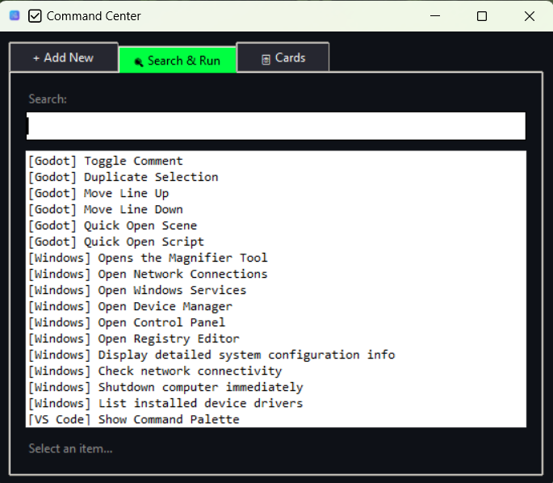
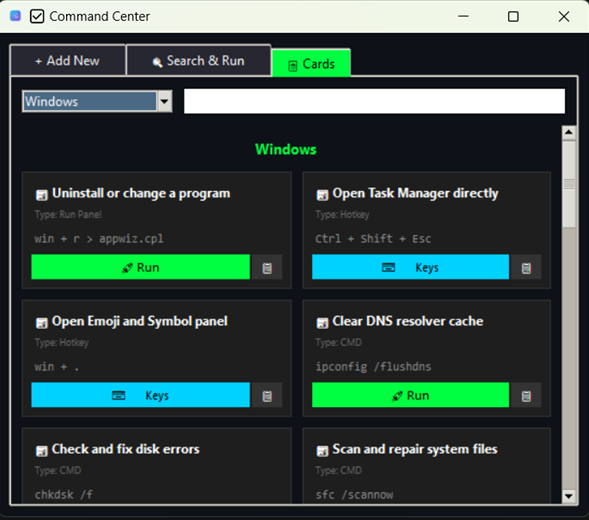
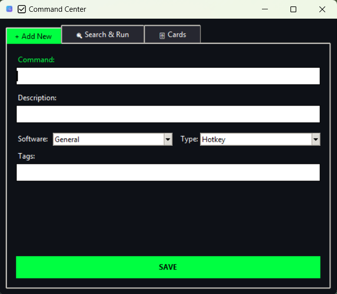
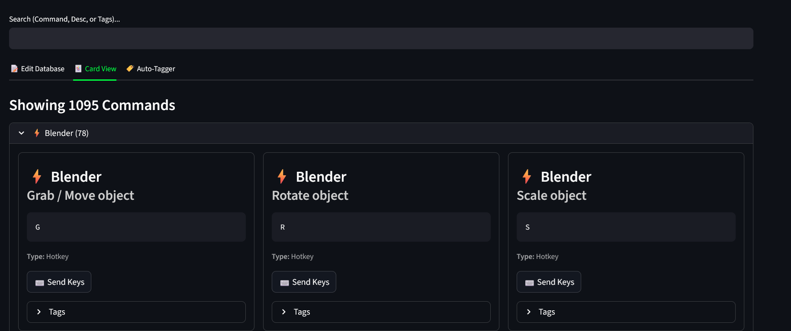
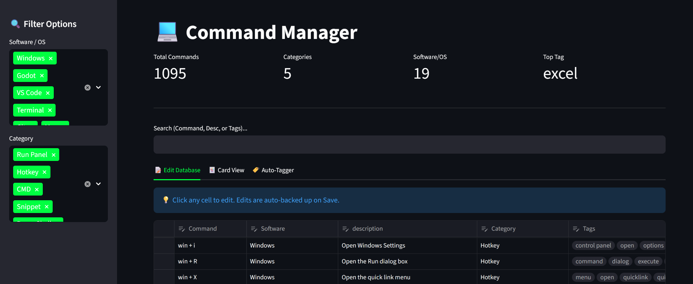
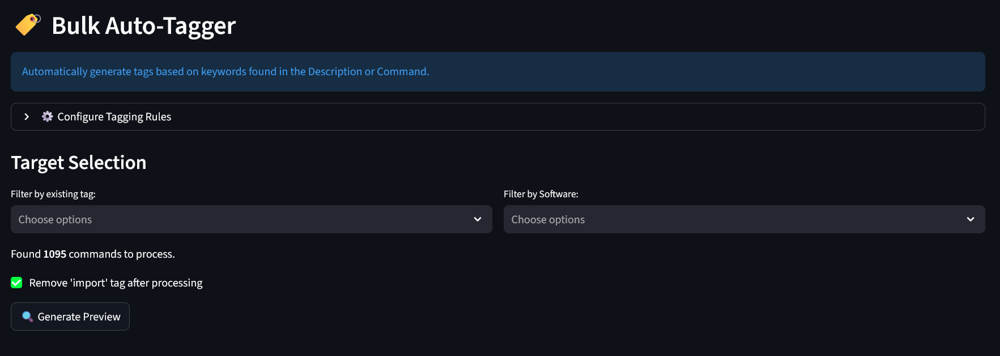
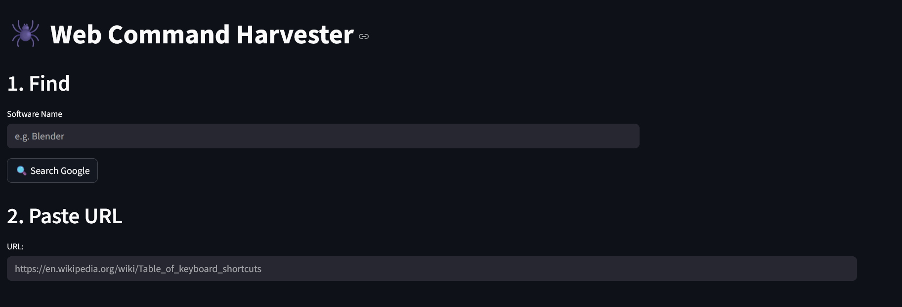

# Command Manager

## Overview
The Command Manager is a personal automation suite designed to store, organize, and execute commands, hotkeys, and workflows. It combines a lightweight background service for global access with a rich visual dashboard for management.

## Quick Start

### Installation
1. **Download**: Clone the repository or download the ZIP file.
2. **Install**: Double-click `INSTALL.bat`.
   - This will set up the Python environment, install dependencies, and configure the app to run at Windows startup.
3. **Run**: The background service will start automatically. You can also start it manually by running `RUN.bat`.

### Pro Tip: Quick Access via Run Dialog
To launch the tools instantly using `Win+R`(Run Dialog):
1. Create a shortcut to `RUN.bat` and rename it to `vcmddb`(Visual Command Database).
2. Create a shortcut to `scripts/cmdsearch.bat` and rename it to `cmddb`(Command Database).
3. Move both shortcuts to `C:\Windows` (or any folder in your system PATH).
4. Now you can press `Win+R` and type `vcmddb` or `cmddb` to launch them!

Alternatively, skip this step and access the features using the **Global Hotkeys**. 

## Key Components

### 1. Quick Launcher (`src/quick_add.py`)
The core background service that listens for global hotkeys.




- **Global Hotkeys**:
  - `Ctrl+Alt+A`: Open the Quick Add/Search widget.
  - `Ctrl+Alt+V`: Launch the Visual Dashboard.
  - `Ctrl+Alt+H`: Launch the Web Harvester.
- **Features**:
  - **Search & Run**: Rapidly find and execute commands.
  - **Card View**: Visual grid of commands grouped by software.
  - **Add New**: Quickly save new commands on the fly.

### 2. Visual Dashboard (`src/visual_db.py`)
A full-featured web interface built with Streamlit.




- **Features**:
  - **Browse & Filter**: Filter by software, category, or tags.
  - **Direct Execution**: Run commands or hotkeys directly from the browser.
  - **Data Editor**: Spreadsheet-like view for bulk editing.
  - **Auto-Tagger**: Automatically tag commands based on keywords.

### 3. Web Harvester (`src/importer.py`)
A utility to scrape and import command lists from websites.


- **Usage**: Paste a URL, select tables, and import. New items are tagged with `import` for easy review.

### 4. CLI Search (`scripts/cmdsearch.bat`)
A lightweight command-line interface for quick access without the GUI.

## Workflows & Automation
You can chain multiple actions together using `;;` as a separator.
- **Example**: `Win+R ;; WAIT 1 ;; notepad ;; WAIT 1 ;; Hello World`
- **Keywords**:
  - `WAIT X`: Pauses execution for X seconds.
  - `CMD [command]`: Forces execution as a shell command.
  - `TYPE [text]`: Types text.
  - `Win`, `Ctrl`, `Alt`, `Shift`: Modifier keys.

## File Structure
- `INSTALL.bat`: Setup script.
- `RUN.bat`: Manual launcher.
- `UNINSTALL.bat`: Removes the startup shortcut.
- `data/commands.json`: Your database.
- `data/backups/`: Automatic backups.
- `src/`: Source code.
- `scripts/`: Helper batch files.

## Developer Environment & Tooling

### Setup
1. **Clone the repository**:
   ```bash
   git clone https://github.com/Hayds97/CommandDB.git
   cd CommandDB
   ```
2. **Create a virtual environment**:
   ```bash
   python -m venv .venv
   .venv\Scripts\Activate
   ```
3. **Install dependencies**:
   ```bash
   pip install -r requirements.txt
   pip install -r requirements-dev.txt
   ```

### Tools
- **Linting**: `ruff check .`
- **Testing**: `pytest`
- **Formatting**: `black .`

### Project Structure
- `src/quick_add.py`: Tkinter-based background service.
- `src/visual_db.py`: Streamlit-based web dashboard.
- `src/utils.py`: Shared logic for command execution and hotkeys.

## Requirements
- Windows 10/11
- Python 3.12+
